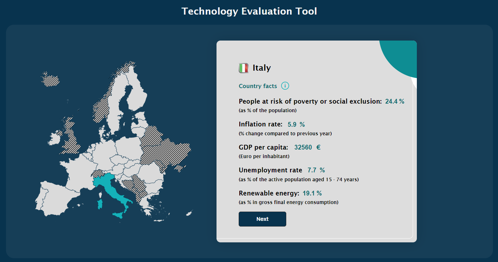
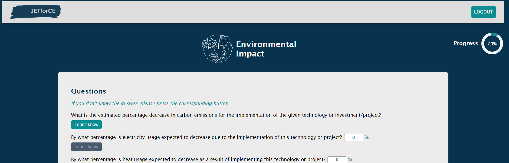
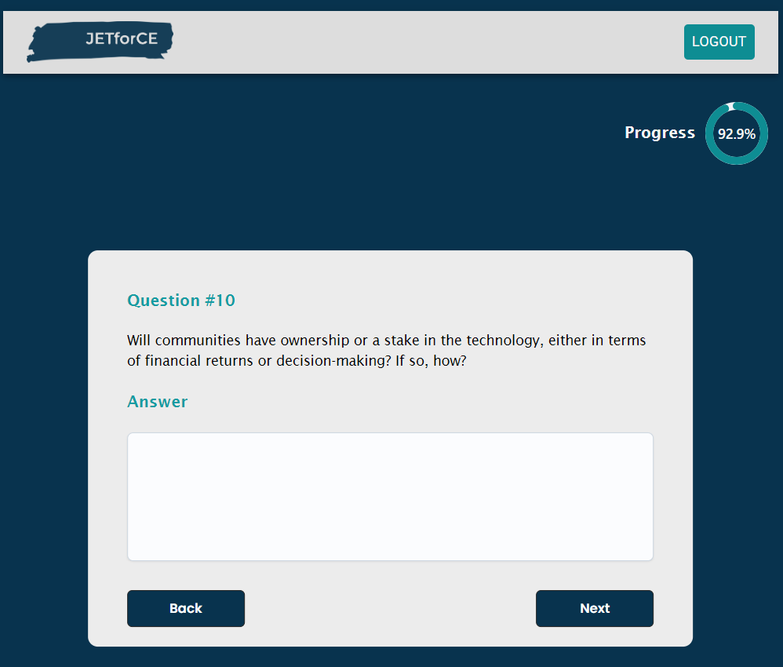
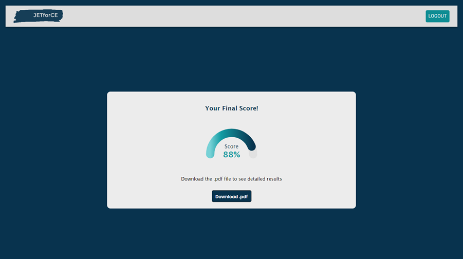
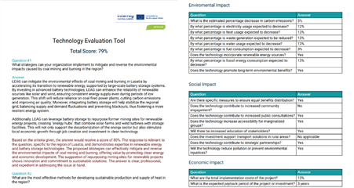

# Green Energy Investment Decision-Support App

A **decision-support platform** that evaluates the **cost-effectiveness** and **social impact** of green energy investments across Europe.

By leveraging **real-time data** from Eurostat and other trusted APIs, the system dynamically adapts indicators based on the selected country. Through a guided Q\&A process, decision-makers provide inputs that are evaluated by **AI-enhanced logic**, delivering a robust, data-informed **investment score**.

The platform is designed with the principles of a **Just Energy Transition**, balancing **energy performance** with **social equity**. It helps policymakers and stakeholders prioritize investments in **energy efficiency** and **renewable technologies** while ensuring fair, inclusive outcomes.

---

## 🛠 Technologies / Tools

* **Node.js** (backend services)
* **React** (frontend application)
* **Firebase** (authentication, Firestore database, hosting, functions)

---

## 🌍 Key Features

* **Country-Specific Adaptation** – evaluation indicators auto-adjust based on Eurostat and other national data.
* **Real-Time Data Integration** – pulls socioeconomic and energy data from trusted APIs for up-to-date context.
* **AI-Enhanced Evaluation** – answers are processed through models that compute weighted investment scores.
* **Just Transition Framework** – considers cost-efficiency, social justice, and community impact.
* **User-Centric Flow** – interactive questionnaire guiding decision-makers with specialized metrics.
* **Custom Reports** – downloadable PDFs with insights and recommendations for policy and investment planning.

---

## 📸 Platform Walkthrough

> Replace the placeholder images in `./images/` with real screenshots.

2. **Choose Country** – Users select an EU country from an interactive map and metrics from Eurostat are applied and displayed via API.
   

2. **Data Input** – Users provide context and country-specific parameters.
   

3. **Q\&A Process** – Users answer guided questions, evaluated in real-time by the AI logic.
   

4. **Investment Score** – The system calculates and visualizes the weighted investment score.
   

5. **Generated Report (PDF)** – A downloadable report with metrics, recommendations, and contextual insights.
   

---

## 🚀 Installation

Clone the repository:

```bash
git clone <your-repo-url>
cd <repo-folder>
```

Install dependencies:

```bash
npm install
```

Set up Firebase:

1. Create a Firebase project in [Firebase Console](https://console.firebase.google.com/).
2. Add a web app and copy the config to your `.env` or `firebaseConfig.js`.
3. Enable Firestore, Authentication, and Hosting.

---

## ▶️ Usage

Start development server:

```bash
npm start
```

Deploy to Firebase Hosting:

```bash
firebase deploy
```

---

## 📄 Notes

* Store your Firebase API keys and service account securely (never commit to Git).
* Replace placeholder screenshots in `./images/` with real app images.
* Ensure correct Firestore rules for secure data handling.

---
